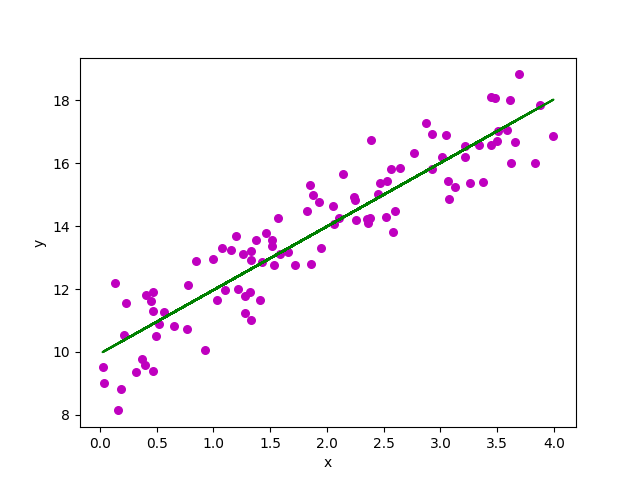

# Welcome to My Linear Regression
***

## Task
For example, let's say we want to know what a cat is. We can learn by heart some pictures of cats and then classify as cat animals that are similar to the pictures.
We then need a way to "measure" similarity. This is called instance-based learning.

Another way of generalizing is by creating a model from the existing examples and make prediction based on that model.

## Description
This model has two parameters, θ0 and θ1. After choosing the right values for them, we can make our model represent a linear function matching the data:

Everything stands in "choosing the right values". The "right values" are those for which our model performs "best".
We then need to define a performance measure (how well the model performs) or a cost function (how bad the model performs).

These kind of problems and models are called Linear Regression.
The goal of this journey is to explore linear and logistic regressions.

- def h(x, theta)
Write the linear hypothesis function. (see above)

- def mean_squared_error(y_pred, y_label)
Write the Mean Squared Error function between the predicted values and the labels.

- def bias_column(x)
Write a function which adds one to each instance.

X_new = bias_column(x)

print(X[:5])
print(" ---- ")
print(X_new[:5])

You should see something similar to:

[[0.91340515]
 [0.14765626]
 [3.75646273]
 [2.23004972]
 [1.94209257]]
 ---- 
[[1.         0.91340515]
 [1.         0.14765626]
 [1.         3.75646273]
 [1.         2.23004972]
 [1.         1.94209257]]

 Classes

 class LeastSquaresRegression: (see description above)
  def __init__(self, )
  def fit()
  def predict

class GradientDescentOptimizer: (see description above)
  def __init__()
  def step()
  def optimize()
  def getCurrentValue()

## Installation
pip install numpy
pip install matplotlib
pip install mpl_toolkits

## Usage
python my_linear_regression.py